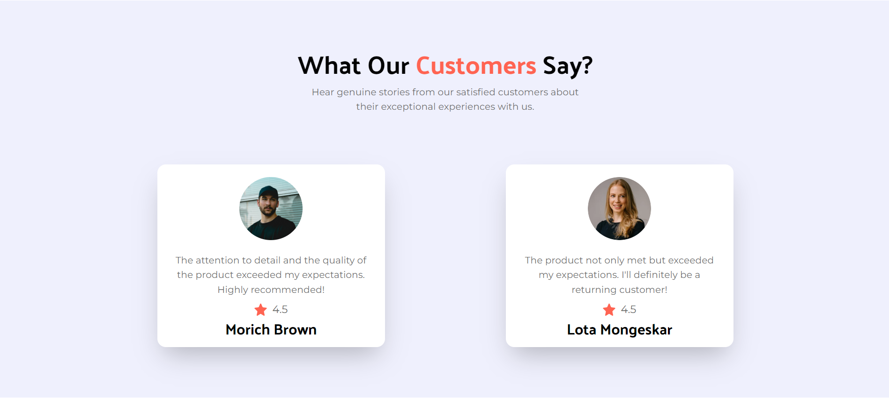

## Basic Static Landing Page 
I have built this static landing page as part of my Tailwind css Learning jounrey.

### Technologies Used
- React.js ( JavaScript )
- Tailwind CSS for stylin
- Vite for development server and build tool

I would like to thank ***<a href="https://www.youtube.com/@javascriptmastery">Javascript Mastery</a>*** for the inspiration and guidance in building this project.

### Preview of the Project

